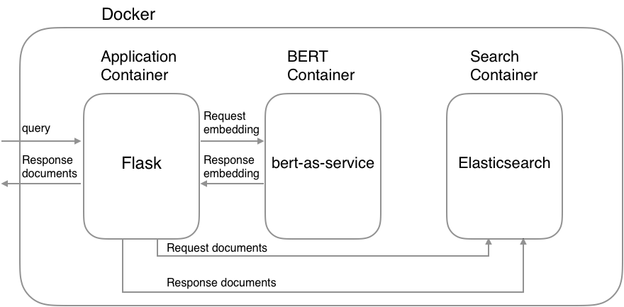

# Elasticsearch meets BERT

Below is a job search example:


## System architecture



## Getting Started

### 1. Download a pretrained BERT model

<details>
 <summary>List of released pretrained BERT models (click to expand...)</summary>


<table>
<tr><td><a href="https://storage.googleapis.com/bert_models/2018_10_18/uncased_L-12_H-768_A-12.zip">BERT-Base, Uncased</a></td><td>12-layer, 768-hidden, 12-heads, 110M parameters</td></tr>
<tr><td><a href="https://storage.googleapis.com/bert_models/2018_10_18/uncased_L-24_H-1024_A-16.zip">BERT-Large, Uncased</a></td><td>24-layer, 1024-hidden, 16-heads, 340M parameters</td></tr>
<tr><td><a href="https://storage.googleapis.com/bert_models/2018_10_18/cased_L-12_H-768_A-12.zip">BERT-Base, Cased</a></td><td>12-layer, 768-hidden, 12-heads , 110M parameters</td></tr>
<tr><td><a href="https://storage.googleapis.com/bert_models/2018_10_18/cased_L-24_H-1024_A-16.zip">BERT-Large, Cased</a></td><td>24-layer, 1024-hidden, 16-heads, 340M parameters</td></tr>
<tr><td><a href="https://storage.googleapis.com/bert_models/2018_11_23/multi_cased_L-12_H-768_A-12.zip">BERT-Base, Multilingual Cased (New)</a></td><td>104 languages, 12-layer, 768-hidden, 12-heads, 110M parameters</td></tr>
<tr><td><a href="https://storage.googleapis.com/bert_models/2018_11_03/multilingual_L-12_H-768_A-12.zip">BERT-Base, Multilingual Cased (Old)</a></td><td>102 languages, 12-layer, 768-hidden, 12-heads, 110M parameters</td></tr>
<tr><td><a href="https://storage.googleapis.com/bert_models/2018_11_03/chinese_L-12_H-768_A-12.zip">BERT-Base, Chinese</a></td><td>Chinese Simplified and Traditional, 12-layer, 768-hidden, 12-heads, 110M parameters</td></tr>
</table>

</details>

```bash
$ wget https://storage.googleapis.com/bert_models/2018_10_18/cased_L-12_H-768_A-12.zip
$ unzip cased_L-12_H-768_A-12.zip
```

### 2. Set environment variables

You need to set a pretrained BERT model and Elasticsearch's index name as environment variables:

```bash
$ export PATH_MODEL=./cased_L-12_H-768_A-12
$ export INDEX_NAME=jobsearch
```

### 3. Run Docker containers


```bash
$ docker-compose up
```

**CAUTION**: If possible, assign high memory(more than `8GB`) to Docker's memory configuration because BERT container needs high memory.

### 4. Create index

You can use the create index API to add a new index to an Elasticsearch cluster. When creating an index, you can specify the following:

* Settings for the index
* Mappings for fields in the index
* Index aliases

For example, if you want to create `jobsearch` index with `title`, `text` and `text_vector` fields, you can create the index by the following command:

```bash
$ python example/create_index.py --index_file=example/index.json --index_name=jobsearch
# index.json
{
  "settings": {
    "number_of_shards": 2,
    "number_of_replicas": 1
  },
  "mappings": {
    "dynamic": "true",
    "_source": {
      "enabled": "true"
    },
    "properties": {
      "title": {
        "type": "text"
      },
      "text": {
        "type": "text"
      },
      "text_vector": {
        "type": "dense_vector",
        "dims": 768
      }
    }
  }
}
```

**CAUTION**: The `dims` value of `text_vector` must need to match the dims of a pretrained BERT model.

### 5. Create documents

Once you created an index, you’re ready to index some document. The point here is to convert your document into a vector using BERT. The resulting vector is stored in the `text_vector` field. Let`s convert your data into a JSON document:

```bash
$ python example/create_documents.py --data=example/example.csv --index_name=jobsearch
# example/example.csv
"Title","Description"
"Saleswoman","lorem ipsum"
"Software Developer","lorem ipsum"
"Chief Financial Officer","lorem ipsum"
"General Manager","lorem ipsum"
"Network Administrator","lorem ipsum"
```

After finishing the script, you can get a JSON document like follows:

```python
# documents.jsonl
{"_op_type": "index", "_index": "jobsearch", "text": "lorem ipsum", "title": "Saleswoman", "text_vector": [...]}
{"_op_type": "index", "_index": "jobsearch", "text": "lorem ipsum", "title": "Software Developer", "text_vector": [...]}
{"_op_type": "index", "_index": "jobsearch", "text": "lorem ipsum", "title": "Chief Financial Officer", "text_vector": [...]}
...
```

### 6. Index documents

After converting your data into a JSON, you can adds a JSON document to the specified index and makes it searchable.

```bash
$ python example/index_documents.py
```

### 7. Open browser

Go to <http://127.0.0.1:5000>.
